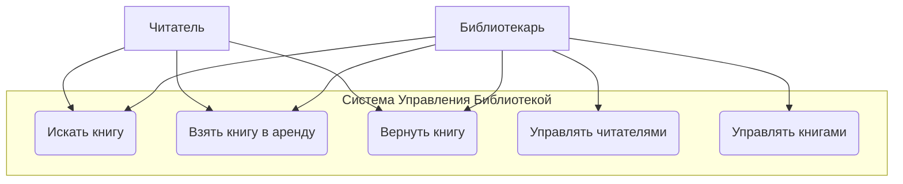
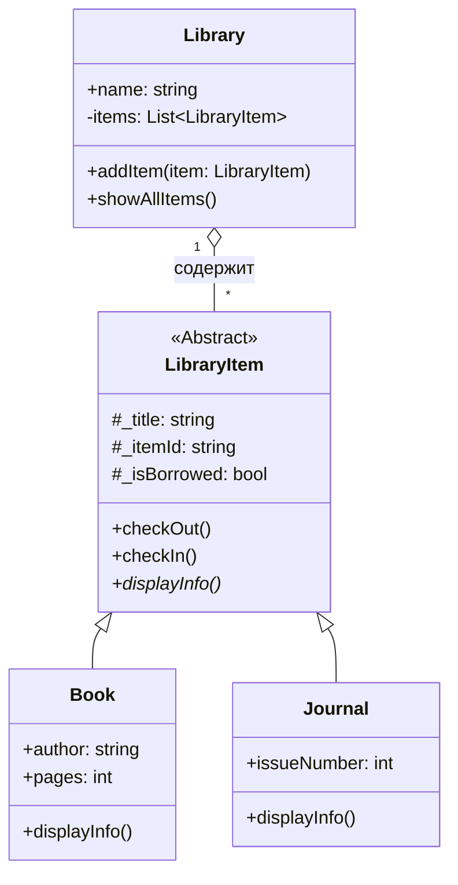

# Ответы на Задачи по ООП (пересдача)

## 1\. Различия Парадигм Программирования, Значение ООП и Связь между Классом и Объектом

### Парадигмы Программирования

Парадигма программирования — это стиль или подход к написанию кода. Основные парадигмы:

1.  **Процедурное программирование:** Код выполняется последовательно, сверху вниз, как набор процедур или функций, которые обрабатывают данные. Основное внимание уделяется алгоритмам.

    - _Примеры языков:_ C, Pascal, FORTRAN.

2.  **Функциональное программирование:** Программа рассматривается как набор математических функций. Этот подход избегает изменяемого состояния данных (mutable state) и побочных эффектов (side effects).

    - _Примеры языков:_ Haskell, Lisp, F\#, JavaScript (частично).

3.  **Объектно-Ориентированное Программирование (ООП):** Программа строится как совокупность взаимодействующих «объектов». Каждый объект имеет свои данные (свойства) и поведение (методы).

    - _Примеры языков:_ Java, Python, C++, C\#, JavaScript.

### Значение ООП

ООП предоставляет несколько ключевых преимуществ в разработке:

- **Модульность:** Код разделен на независимые объекты, что упрощает его понимание, тестирование и обслуживание.
- **Повторное использование кода (Reusability):** Классы можно использовать многократно. С помощью наследования можно создавать новые классы на основе существующих, что избавляет от написания повторяющегося кода.
- **Безопасность:** Инкапсуляция позволяет скрыть внутренние данные объекта от внешнего вмешательства, предоставляя доступ к ним только через специальные методы (геттеры и сеттеры).
- **Расширяемость:** С помощью полиморфизма и наследования легко добавлять новую функциональность, не изменяя существующий работающий код.

### Связь между Классом и Объектом

Связь между классом и объектом лучше всего описывается аналогией **"чертёж и здание"**:

- **Класс (Class):** Это **чертёж** или **шаблон** для объекта. Он определяет, какие свойства (атрибуты) и какое поведение (методы) будут у объекта. Сам по себе класс не является реальной сущностью в памяти, это лишь описание структуры.
- **Объект (Object):** Это **конкретный экземпляр**, созданный на основе класса. Это **здание**, построенное по чертежу. Каждый объект имеет свои собственные значения свойств, занимает место в памяти и может выполнять действия, описанные в классе.

Проще говоря, **Класс — это идея, а Объект — её реальное воплощение.**

---

## 2\. Программа-проект на Основе Ключевых Концепций ООП

Из списка проектов выбран **№3 "Library Management" (Система управления библиотекой)**. Ниже приведена реализация на JavaScript с объяснением применения всех концепций ООП.

### Код Программы (JavaScript)

```js
// Абстракция (Abstraction)
// В JS нет встроенных абстрактных классов, поэтому мы имитируем их,
// выбрасывая ошибку в методах, которые должны быть переопределены.
class LibraryItem {
  constructor(title, itemId) {
    if (this.constructor === LibraryItem) {
      throw new Error(
        "Нельзя создать экземпляр абстрактного класса LibraryItem."
      );
    }
    // Инкапсуляция (Encapsulation) - используем _ для обозначения "защищенных" свойств
    this._title = title;
    this._itemId = itemId;
    this._isBorrowed = false;
  }

  checkOut() {
    this._isBorrowed = true;
  }

  checkIn() {
    this._isBorrowed = false;
  }

  // Абстрактный метод, который должен быть реализован в дочерних классах
  displayInfo() {
    throw new Error("Метод 'displayInfo()' должен быть реализован.");
  }
}

// Наследование (Inheritance)
class Book extends LibraryItem {
  constructor(title, itemId, author, pages) {
    super(title, itemId); // Вызов конструктора родительского класса
    this.author = author;
    this.pages = pages;
  }

  // Полиморфизм (Polymorphism) - переопределение метода displayInfo
  displayInfo() {
    const status = this._isBorrowed ? "В аренде" : "Доступна";
    console.log("--- Книга ---");
    console.log(
      `ID: ${this._itemId}, Название: ${this._title}, Автор: ${this.author}`
    );
    console.log(`Статус: ${status}\n`);
  }
}

class Journal extends LibraryItem {
  constructor(title, itemId, issueNumber) {
    super(title, itemId);
    this.issueNumber = issueNumber;
  }

  // Полиморфизм (Polymorphism) - своя реализация метода displayInfo
  displayInfo() {
    const status = this._isBorrowed ? "В аренде" : "Доступен";
    console.log("--- Журнал ---");
    console.log(
      `ID: ${this._itemId}, Название: ${this._title}, Номер выпуска: ${this.issueNumber}`
    );
    console.log(`Статус: ${status}\n`);
  }
}

// Класс и Объект
class Library {
  constructor(name) {
    this.name = name;
    this.items = [];
  }

  addItem(item) {
    this.items.push(item);
    console.log(`'${item._title}' добавлен(а) в библиотеку.`);
  }

  showAllItems() {
    console.log(`--- Все элементы в библиотеке "${this.name}" ---`);
    for (const item of this.items) {
      item.displayInfo(); // Здесь работает полиморфизм
    }
  }
}

// --- Запуск программы ---

// Создание объектов (Objects)
const book1 = new Book("Алхимик", "B001", "Пауло Коэльо", 250);
const book2 = new Book("Прошлые дни", "B002", "Абдулла Кадыри", 400);
const journal1 = new Journal("National Geographic", "J001", 125);

// Создание объекта Library
const myLibrary = new Library("Национальная Библиотека");

// Добавление элементов
myLibrary.addItem(book1);
myLibrary.addItem(book2);
myLibrary.addItem(journal1);
console.log("\n");

// Выдаем книгу в аренду
book1.checkOut();

// Показываем информацию о всех элементах
myLibrary.showAllItems();
```

### Применение Концепций ООП

1.  **Класс и Объект:**
    - `LibraryItem`, `Book`, `Journal`, `Library` — это **Классы**.
    - `book1`, `book2`, `journal1`, `myLibrary` — это **Объекты**, созданные из этих классов.
2.  **Инкапсуляция:**
    - Свойства `_title`, `_itemId`, `_isBorrowed` начинаются с `_`. Это соглашение в JS, которое говорит, что эти свойства не предназначены для прямого доступа извне. Управление ими происходит через методы `checkOut()` и `checkIn()`.
3.  **Наследование:**
    - Классы `Book` и `Journal` наследуются от `LibraryItem` с помощью ключевого слова `extends`. Они получают общие свойства и методы, избегая дублирования кода.
4.  **Полиморфизм:**
    - `Book` и `Journal` имеют собственную реализацию метода `displayInfo()`.
    - В методе `myLibrary.showAllItems()` цикл вызывает `item.displayInfo()` для каждого элемента, не зная его конкретного типа. JavaScript автоматически вызывает правильную версию метода для книги или для журнала.
5.  **Абстракция:**
    - `LibraryItem` служит абстрактным классом. Мы не можем создать его экземпляр (`new LibraryItem(...)` вызовет ошибку). Он определяет общий "контракт" (интерфейс) для всех элементов библиотеки: у каждого должен быть метод `displayInfo()`.

---

## 3\. Типы UML-диаграмм и Диаграммы для Проекта

### Типы и Назначение UML-диаграмм

**UML (Unified Modeling Language)** — это стандартный графический язык для визуализации, проектирования и документирования программных систем. Диаграммы делятся на две большие группы:

1.  **Структурные диаграммы (Structural Diagrams):** Описывают статическую структуру системы.

    - **Диаграмма классов (Class Diagram):** Показывает классы, их атрибуты, методы и отношения между ними. Самая популярная диаграмма.
    - **Диаграмма компонентов (Component Diagram):** Показывает физические компоненты системы (библиотеки, файлы, модули).
    - **Диаграмма развёртывания (Deployment Diagram):** Показывает, как компоненты ПО размещаются на физическом оборудовании (серверах).

2.  **Поведенческие диаграммы (Behavioral Diagrams):** Описывают динамическое поведение системы.

    - **Диаграмма прецедентов (Use Case Diagram):** Описывает функциональность системы с точки зрения пользователя (актора). Показывает, _что_ система делает.
    - **Диаграмма последовательности (Sequence Diagram):** Показывает взаимодействие объектов в хронологическом порядке.
    - **Диаграмма деятельности (Activity Diagram):** Моделирует пошаговые рабочие процессы (workflow).

### UML-диаграммы для проекта "Library Management"

#### Диаграмма Прецедентов (Use Case Diagram)

Эта диаграмма показывает, как **Акторы** (Библиотекарь и Читатель) взаимодействуют с системой.



**Описание:**

- **Акторы:** `Читатель`, `Библиотекарь`.
- **Прецеденты:**
  - `Читатель` может искать, брать и возвращать книги.
  - `Библиотекарь` может делать всё то же самое, плюс управлять базой книг и читателей в системе.

#### Диаграмма Классов (Class Diagram)

Эта диаграмма визуализирует структуру JS-кода из задачи №2.



**Описание:**

- `LibraryItem` — абстрактный класс, от которого наследуются `Book` и `Journal`.
- `Library` содержит в себе (`агрегация`) множество объектов типа `LibraryItem`.
- Символы `+`, `-`, `#` обозначают `public`, `private`, `protected`.

---

## 4\. Принципы SOLID и Программная Реализация

### Объяснение Принципов SOLID

**SOLID** — это акроним для пяти принципов объектно-ориентированного дизайна, которые помогают создавать более понятный, гибкий и поддерживаемый код.

1.  **S - Single Responsibility Principle (Принцип единственной ответственности):**

    - _Каждый класс должен иметь только одну причину для изменения._ Это значит, что класс должен выполнять только одну задачу.

2.  **O - Open/Closed Principle (Принцип открытости/закрытости):**

    - _Программные сущности (классы, модули) должны быть открыты для расширения, но закрыты для изменения._ Новая функциональность должна добавляться путем наследования или композиции, а не изменением существующего кода.

3.  **L - Liskov Substitution Principle (Принцип подстановки Барбары Лисков):**

    - _Объекты в программе должны быть заменяемы на экземпляры их подтипов без изменения правильности выполнения программы._ Если у вас есть функция, которая работает с базовым классом, она должна так же корректно работать с любым его дочерним классом.

4.  **I - Interface Segregation Principle (Принцип разделения интерфейса):**

    - _Клиенты не должны зависеть от методов, которые они не используют._ Лучше иметь много маленьких, специфических интерфейсов, чем один большой и универсальный.

5.  **D - Dependency Inversion Principle (Принцип инверсии зависимостей):**

    - _Модули верхнего уровня не должны зависеть от модулей нижнего уровня. И те, и другие должны зависеть от абстракций._ Абстракции не должны зависеть от деталей. Детали должны зависеть от абстракций.

### Проект: №4 "Order Restaurant Management" (Управление заказами в ресторане)

```js
// --- S: Принцип единственной ответственности ---
// Каждый класс выполняет свою четкую задачу.
class Order {
  // Отвечает только за хранение данных о заказе.
  constructor() {
    this.items = [];
    this.status = "open";
  }

  addItem(item, price) {
    this.items.push({ item, price });
  }

  getTotalPrice() {
    return this.items.reduce((total, item) => total + item.price, 0);
  }
}

class OrderManager {
  // Отвечает только за управление заказами (например, сохранение в базу).
  placeOrder(order) {
    console.log("Заказ принят и обрабатывается.");
    order.status = "placed";
  }
}

// --- O: Принцип открытости/закрытости и D: Принцип инверсии зависимостей ---
// Система оплаты зависит от абстракции (PaymentProcessor),
// а не от конкретных классов. Легко добавить новый способ оплаты, не меняя старый код.
class PaymentProcessor {
  // Абстрактный класс для обработки платежей
  processPayment(amount) {
    throw new Error("Метод processPayment должен быть реализован");
  }
}

class CreditCardProcessor extends PaymentProcessor {
  processPayment(amount) {
    console.log(`Оплачено ${amount} руб. кредитной картой.`);
  }
}

class CashProcessor extends PaymentProcessor {
  processPayment(amount) {
    console.log(`Оплачено ${amount} руб. наличными.`);
  }
}

class PaymentService {
  // Зависит от абстракции PaymentProcessor, а не от конкретной реализации
  pay(order, processor) {
    const total = order.getTotalPrice();
    processor.processPayment(total);
  }
}

// --- L: Принцип подстановки Лисков ---
class Discount {
  apply(total) {
    throw new Error("Метод apply должен быть реализован");
  }
}

class PercentageDiscount extends Discount {
  constructor(percentage) {
    super();
    this.percentage = percentage;
  }

  apply(total) {
    return total * (1 - this.percentage / 100);
  }
}

class FixedDiscount extends Discount {
  constructor(amount) {
    super();
    this.amount = amount;
  }

  apply(total) {
    return Math.max(0, total - this.amount);
  }
}

// Эта функция может работать с любым наследником класса Discount (LSP)
function applyDiscountToOrder(order, discount) {
  const total = order.getTotalPrice();
  const discountedTotal = discount.apply(total);
  console.log(`Цена со скидкой: ${discountedTotal.toFixed(2)} руб.`);
}

// --- I: Принцип разделения интерфейса ---
// Вместо одного большого класса "Работник" создаем маленькие, специфичные роли.
// В JS это часто реализуется через композицию или просто наличием нужных методов.
class Waiter {
  takeOrder() {
    console.log("Официант принимает заказ.");
  }
}

class Chef {
  cookFood() {
    console.log("Повар готовит еду.");
  }
}

// --- Запуск программы ---
const order = new Order();
order.addItem("Плов", 350);
order.addItem("Салат", 150);
order.addItem("Чай", 50);

const orderManager = new OrderManager();
orderManager.placeOrder(order);

const paymentService = new PaymentService();
const creditCardProcessor = new CreditCardProcessor();
paymentService.pay(order, creditCard - processor);

// Проверка принципа Лисков
const percentDiscount = new PercentageDiscount(10); // скидка 10%
applyDiscountToOrder(order, percentDiscount);

const fixedDiscount = new FixedDiscount(100); // скидка 100 руб.
applyDiscountToOrder(order, fixedDiscount);
```

---

## 5\. Группы и Типы Принципов Дизайна и Программная Реализация

### Принципы Дизайна

**Принципы дизайна** — это общие рекомендации по созданию качественного, управляемого и долговечного ПО. SOLID — одна из таких групп принципов. Другие известные принципы:

1.  **DRY (Don't Repeat Yourself - Не повторяйся):**

    - _Описание:_ Избегайте дублирования кода и логики. Каждая часть информации в системе должна иметь единственное, однозначное и авторитетное представление.
    - _Цель:_ Упростить внесение изменений. Если логика меняется, ее нужно исправить только в одном месте.

2.  **KISS (Keep It Simple, Stupid - Делай проще, дурачок):**

    - _Описание:_ Системы следует проектировать как можно проще, без ненужных усложнений. Часто самое простое решение — самое лучшее.
    - _Цель:_ Упростить понимание, чтение и поддержку кода.

3.  **YAGNI (You Ain't Gonna Need It - Тебе это не понадобится):**

    - _Описание:_ Не добавляйте функциональность, которая не требуется прямо сейчас. Реализуйте только то, что необходимо в данный момент.
    - _Цель:_ Избежать лишней работы, усложнения системы и потенциальных ошибок.

### Проект: №5 "Expense Tracker" (Трекер расходов)

Этот код следует приведенным выше принципам. **Примечание:** для работы с файлами здесь используется API Node.js. Этот код нужно запускать в среде Node.js.

```js
// Для работы с файлами в Node.js
const fs = require("fs");
const path = require("path");

// --- DRY (Don't Repeat Yourself) ---
// Логика сохранения и загрузки данных вынесена в отдельные функции,
// чтобы избежать дублирования кода.
function saveData(filename, data) {
  fs.writeFileSync(filename, JSON.stringify(data, null, 4));
}

function loadData(filename) {
  try {
    const fileContent = fs.readFileSync(filename, "utf8");
    return JSON.parse(fileContent);
  } catch (error) {
    // Если файл не найден, возвращаем пустой массив
    return [];
  }
}

// --- KISS (Keep It Simple, Stupid) ---
// Структура очень проста: один класс для Расхода (Expense) и один для Трекера (Tracker).
// Никаких сложных иерархий или лишних абстракций.
class Expense {
  constructor(amount, category, description) {
    this.amount = amount;
    this.category = category;
    this.description = description;
    this.date = new Date().toISOString().split("T")[0]; // YYYY-MM-DD
  }
}

class ExpenseTracker {
  constructor(filename = "expenses.json") {
    this.filename = filename;
    // --- YAGNI (You Ain't Gonna Need It) ---
    // Реализованы только базовые функции: добавить, показать, посчитать сумму.
    // Функции вроде конвертации валют, планирования бюджета или построения графиков
    // не добавлены, потому что они пока не нужны.
    this.expenses = loadData(this.filename).map(
      (data) => new Expense(data.amount, data.category, data.description)
    );
  }

  addExpense(amount, category, description) {
    const expense = new Expense(amount, category, description);
    this.expenses.push(expense);
    this._save();
    console.log(`Добавлено: ${amount} руб., Категория: ${category}`);
  }

  showExpenses() {
    if (this.expenses.length === 0) {
      console.log("Расходов пока нет.");
      return;
    }

    this.expenses.forEach((exp) => {
      console.log(
        `${exp.date} - [${exp.category}] - ${exp.amount} руб. (${exp.description})`
      );
    });
  }

  getTotalExpense() {
    const total = this.expenses.reduce((sum, exp) => sum + exp.amount, 0);
    console.log(`Общая сумма расходов: ${total} руб.`);
  }

  _save() {
    saveData(this.filename, this.expenses);
  }
}

// --- Запуск программы ---
const tracker = new ExpenseTracker();

// Добавляем расходы
tracker.addExpense(1500, "Продукты", "Покупка в супермаркете");
tracker.addExpense(300, "Транспорт", "Проезд на автобусе");

// Показываем все расходы
console.log("\n--- Все Расходы ---");
tracker.showExpenses();

// Считаем общую сумму
console.log("\n--- Итог ---");
tracker.getTotalExpense();
```
